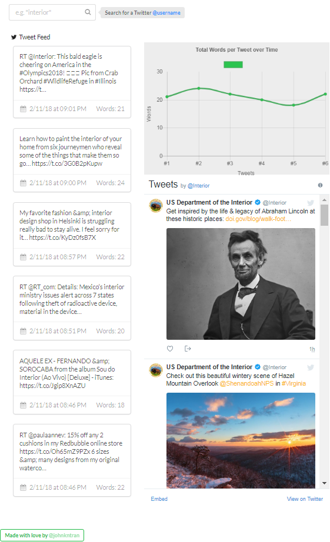

# haystax10 Backend
It is non-trivial to set up the backend API for a Python server with Apache. You probably don't want to do this on your own unless you're committed to launching this product.

## See the Live Demo
See a live demo at [http://35.196.237.113/haystax10](http://35.196.237.113/haystax10/) (in progress)
<p align="left">
  <a href="http://35.196.237.113/haystax10/">
    
    
  </a>
</p>

## Launching the Backend Locally
You can launch the backend API locally by following these steps.

### Prerequisites
* [Python](https://www.python.org/downloads/) - an open source language
* [mod_wsgi](http://modwsgi.readthedocs.io/en/develop/) - an Apache module to host a Python web application supporting the WSGI specification
* [webob](https://docs.pylonsproject.org/projects/webob/en/stable/index.html) - an HTTP interface for Python
* [tweepy](http://docs.tweepy.org/en/v3.5.0/index.html) - a library for scraping the Twitter API
* [Apache HTTP Server](https://httpd.apache.org/) - an open-source HTTP server for modern operating systems

### Installing
Set up the Apache server and mod_wsgi to run on Apache.
Open the `httpd.conf` or `apach2.conf` file and enable *mod_wsgi*.
Set a `WSGIScriptAlias` to point to `api`. The relevant lines to add in your Apache .conf file are:
```
LoadModule wsgi_module /Library/Python/2.7/site-packages/mod_wsgi/server/mod_wsgi-py27.so
WSGIScriptAlias /api /Library/WebServer/CGI-Executables
```
Install all Python dependencies needed for the project. 
This can be done in a [virtualenv](https://virtualenv.pypa.io/en/stable/) if you don't want to pollute your global namespace.
```
pip install -r requirements.txt # Can enable a virtualenv before installing if desired
```
In the `/backend` directory, move the `config.py` file to somewhere in your Python import path, such as `/Library/Python/2.7/site-packages/`.
Move the `utils.py` and `twitter_search.py` files into the directory where your scripts are served in Apache, typically `/Library/WebServer/CGI-Executables` or `/var/www/wsgi-scripts`.
Restart the Apache server by issueing the command below, depending on your OS.
```
sudo apachectl restart # For Macs
sudo systemctl restart httpd.service # For most Linux's
```
Navigate to [http://localhost/api/twitter_search.py](http://localhost/api/twitter_search.py) on your browser. This will issue a GET request to the API. 
You should see a JSON response that looks like
```
{"result": "True", "traceback": null, "payload": [{...}]}
```
Congratulations, if it all works you should have a flexible and powerful Python API on your server. This simple app demonstrate the tip of the iceberg on what can actually be done.